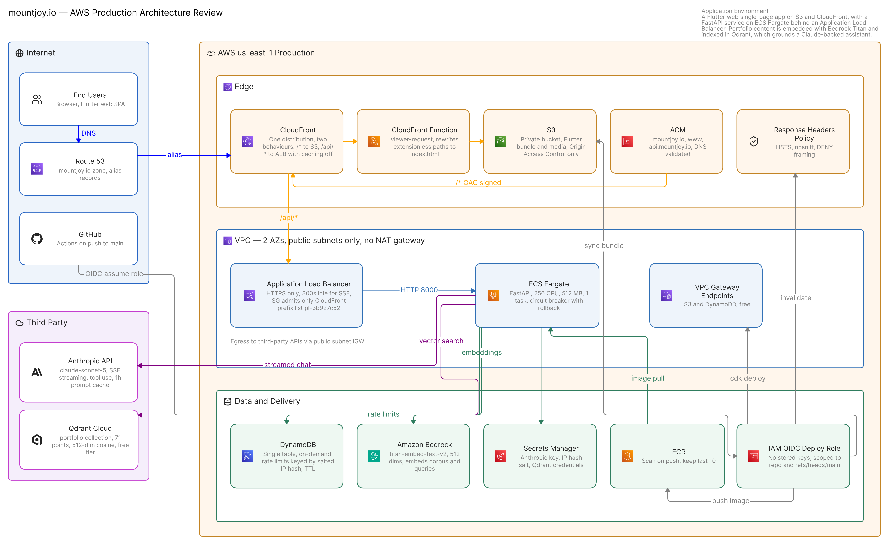

# mountjoy.io

Portfolio site for Mountjoy Software Solutions. The source is public because the
infrastructure is part of what it's meant to show.

## Stack

- **Frontend**: Flutter web, Riverpod
- **Backend**: FastAPI on Python 3.12
- **LLM**: Anthropic Claude (streaming, tool use, prompt caching)
- **Infra**: AWS CDK in Python
- **CI**: GitHub Actions with OIDC

## Infrastructure



Built in Eraser. `docs/architecture.eraser` has the same thing as DSL.

```
mountjoy.io
    |
CloudFront
    |-- /*      -> S3 (private, OAC)     Flutter bundle
    |-- /api/*  -> ALB -> ECS Fargate    FastAPI
                             |
                          DynamoDB
```

One distribution serves both origins, so the browser is same-origin with the API and
there's no CORS involved. The load balancer's security group only accepts the CloudFront
origin-facing prefix list, so the API isn't reachable directly.

Four stacks:

| Stack | Contents |
|---|---|
| `MssPortfolioData` | DynamoDB table, ECR repo, secrets |
| `MssPortfolioApi` | VPC, ECS cluster, Fargate service, ALB |
| `MssPortfolioSite` | S3 bucket, CloudFront, certificate, DNS |
| `MssPortfolioCicd` | GitHub OIDC provider and deploy role |

## Layout

```
backend/    FastAPI service
frontend/   Flutter web client
infra/      CDK app
scripts/    build and push helpers
```

## Running locally

```bash
cd backend
python -m venv .venv
.venv/bin/pip install -r requirements.txt -r requirements-dev.txt
cp .env.example .env    # add your ANTHROPIC_API_KEY
.venv/bin/python -m src.main
```

```bash
cd frontend
flutter pub get
flutter run -d chrome --dart-define=API_BASE=http://localhost:8000
```

`API_BASE` is only for local work. In production the client reads `Uri.base.origin`.

## Deploying

Pushes to `main` build the image, deploy the stacks with the commit SHA as the image tag,
publish the web bundle and invalidate the cache.

By hand:

```bash
cd infra
npx aws-cdk deploy MssPortfolioData
../scripts/push-image.sh
npx aws-cdk deploy --all -c image_tag=<sha>
```

Data stack first, since the task definition points at an image that has to exist already.
